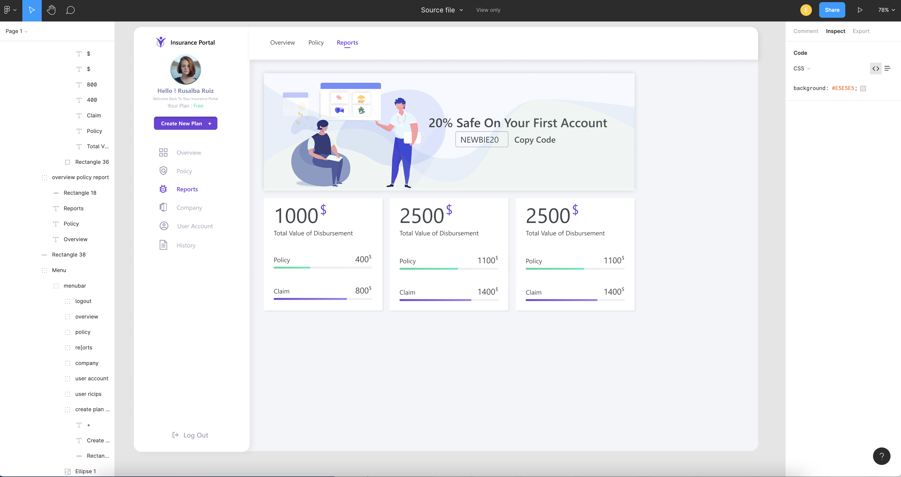

# Appsilon Figma Mockup Design

The purpose of this task is to let you show you my best skills and techniques in frontend development. Please use the graphical mockup of a dashboard below and implement it in a technology of your choice. If you have any questions, please be sure to send us an email!

Open [Figma Link](https://www.figma.com/file/adJlNqUx0AjEi1LSItxK3d/Source-file?node-id=0%3A1)

##

## `Requirements`

- You can use any framework of your choice
- Please publish the created dashboard the way that allow us to view it
- We will be evaluating:
  - How the final effect matches the Figma mockup
  - Responsiveness on different screen sizes
- You don’t have to share your code with us, but if you share a Github repo with us it will definitely be a plus that allows us to see how you structure your code and document it.
- There is no strict deadline or implementation time to complete this assignment. We understand that you may have your plans. Just let us know when we can expect it.

# `Solution`

- [Demo Link](https://appsilon-frontend.web.app/)
- Programing Language : `ReactJs`, SCSS,HTML, CSS, Javascript
- Code Editor: `VS-Code`
- Version Control: `Git`
